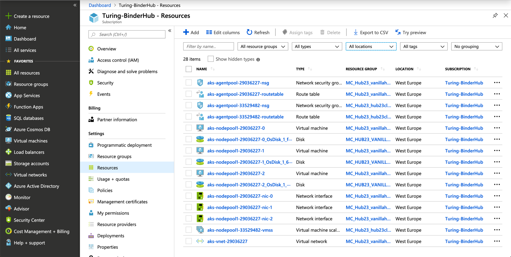
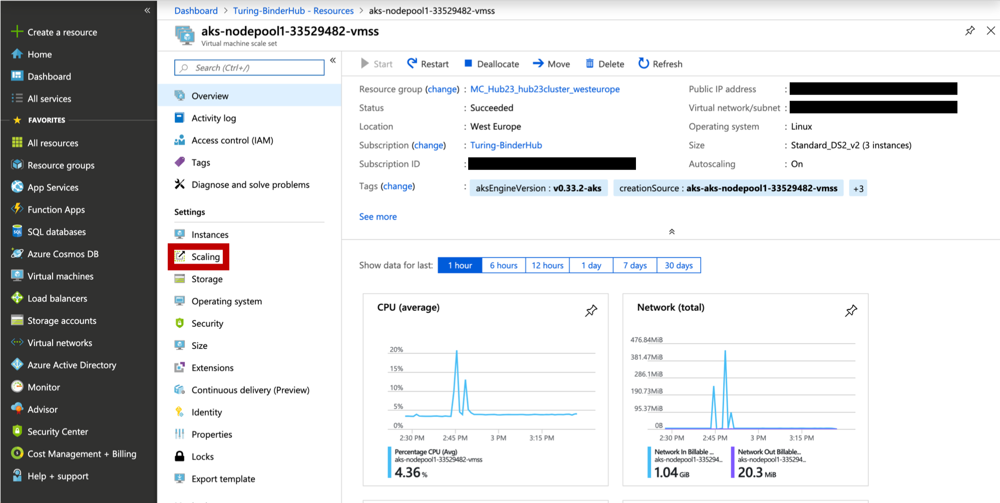
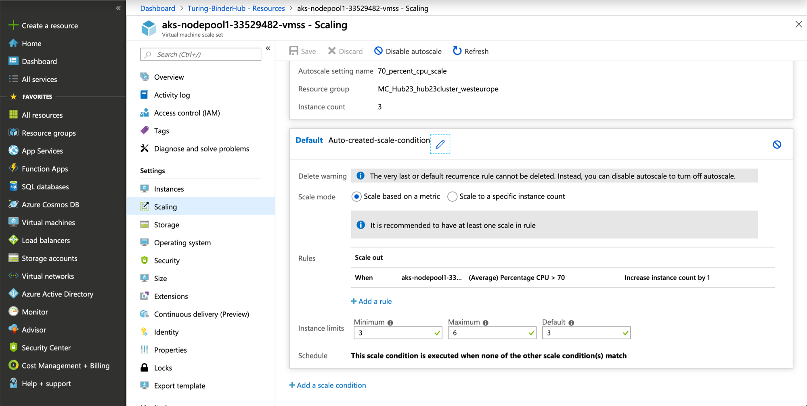

This document walks through the steps required to deploy an autoscaling Kubernetes cluster onto the Turing's Azure subscription.

We assume you have the following CLIs installed:

- [Azure CLI](https://docs.microsoft.com/en-us/cli/azure/install-azure-cli?view=azure-cli-latest)
- [Kubernetes CLI (`kubectl`)](https://kubernetes.io/docs/tasks/tools/install-kubectl/#install-kubectl)

## Table of Contents

- [Setup](#setup)
- [Download the required secrets](#download-the-required-secrets)
- [Enable Network Policies](#enable-network-policies)
- [Set up for Autoscaling](#set-up-for-autoscaling)
- [Create the Kubernetes cluster](#create-the-kubernetes-cluster)
- [Enabling Autoscaling](#enabling-autoscaling)

---

## Setup

#### 1. Login to Azure

```bash
az login --username YOUR_TURING_EMAIL --output none
```

Login with your Turing account.

#### 2. Activate the Subscription

Hub23 has its own subscription and so we have to activate that.

To check which subscriptions you have access to, run the following:

```bash
az account list --refresh --output table
```

You should see `Turing-BinderHub` listed as an option.
If not, request access by opening a TopDesk ticket.

To activate the subscription, run the following:

```bash
az account set --subscription Turing-BinderHub
```

#### 3. Create a Resource Group

Azure groups related resources together by assigning them a Resource Group.
We need to create one for Hub23.

```bash
az group create --name Hub23 --location westeurope --output table
```

- `--name` is what we'll use to identify resources relating to the BinderHub and should be short and descriptive.
  Hence we've given it the same name as our hub.
- `--location` sets the [data centre](https://azure.microsoft.com/en-gb/global-infrastructure/locations/) that will host the resources.
- `--output table` prints the info in a human-readable format.

**NOTE:** If you have already followed the docs on creating a key vault, then this resource group should already exist and this step can be skipped.
{: .notice--info}

## Download the required secrets

We will require some info from the key vault in order to deploy the Kubernetes cluster and the BinderHub.

#### 1. Create a secrets folder

Create a folder in which to download the secrets to.
This will be git-ignored.

```bash
mkdir .secret
```

#### 2. Download the secrets

We will require the following secrets:

- Service Principal app ID and key
- public SSH key

They should be downloaded to files in the `.secret` folder so that they are git-ignored.
Download the Service Principal:

```bash
az keyvault secret download \
    --vault-name hub23-keyvault \
    --name SP-appID \
    --file .secret/appID.txt
```

```bash
az keyvault secret download \
    --vault-name hub23-keyvault \
    --name SP-key \
    --file .secret/key.txt
```

Download the public SSH key:

```bash
az keyvault secret download \
    --vault-name hub23-keyvault \
    --name ssh-key-Hub23cluster-public \
    --file .secret/ssh-key-hub23cluster.pub
```

## Enable Network Policies

The BinderHub helm chart contains network policies designed to restrict access to pods and the JupyterHub.
However, the Kubernetes cluster will not be automatically configured to obey these network policies.
Therefore, we need create a virtual network (vnet) and sub network (subnet) with network policies enabled so that these pod traffic restrictions are obeyed.

See the following documentation: <https://docs.microsoft.com/en-us/azure/aks/use-network-policies#create-an-aks-cluster-and-enable-network-policy>

#### 1. Create a VNET

```bash
az network vnet create \
    --resource-group Hub23 \
    --name hub23-vnet \
    --address-prefixes 10.0.0.0/8 \
    --subnet-name hub23-subnet \
    --subnet-prefix 10.240.0.0/16
```

- `--address-prefixes`: IP address prefixes for the VNet;
- `--subnet-prefix`: IP address prefixes in CIDR format for the new subnet.

#### 2. Retrieve the VNet ID

This saves the VNet ID into a bash variable.

```bash
VNET_ID=$(
    az network vnet show \
    --resource-group Hub23 \
    --name hub23-vnet \
    --query id \
    --output tsv
)
```

#### 3. Assign the Contributor role to the Service Principal for accessing the VNet

```bash
az role assignment create \
    --assignee $(cat .secret/appID.txt) \
    --scope $VNET_ID \
    --role Contributor
```

**WARNING:** You must have Owner permissions on the subscription for this step to work.
{: .notice--warning}

#### 4. Retrieve the subnet ID

This will save the subnet ID to a bash variable.

```bash
SUBNET_ID=$(
    az network vnet subnet show \
    --resource-group Hub23 \
    --vnet-name hub23-vnet \
    --name hub23-subnet \
    --query id \
    --output tsv
)
```

## Set up for Autoscaling

See the following docs:

- <https://docs.microsoft.com/en-us/azure/aks/cluster-autoscaler>
- <https://docs.microsoft.com/en-us/azure/aks/upgrade-cluster>

#### 1. Install aks-preview CLI extension

```bash
az extension add --name aks-preview
```

#### 2. Register scale set feature provider

```bash
az feature register --name VMSSPreview --namespace Microsoft.ContainerService
```

This will take a while to register.
Run the following command to check the status.

```bash
az feature show \
    --name VMSSPreview \
    --namespace Microsoft.ContainerService \
    --output table
```

#### 3. Refresh the registration

```bash
az provider register --namespace Microsoft.ContainerService
```

## Create the Kubernetes cluster

#### 1. Create the AKS cluster

The following command will deploy a Kubernetes cluster into the Hub23 resource group.
This command has been known to take between 7 and 30 minutes to execute depending on resource availability in the location we set when creating the resource group.

```bash
az aks create \
    --resource-group Hub23 \
    --name hub23cluster \
    --kubernetes-version 1.14.8 \
    --node-count 3 \
    --enable-vmss \
    --enable-cluster-autoscaler \
    --min-count 3 \
    --max-count 6 \
    --ssh-key-value .secret/ssh-key-hub23cluster.pub \
    --service-principal $(cat .secret/appID.txt) \
    --client-secret $(cat .secret/key.txt) \
    --dns-service-ip 10.0.0.10 \
    --docker-bridge-address 172.17.0.1/16 \
    --network-plugin azure \
    --network-policy azure \
    --service-cidr 10.0.0.0/16 \
    --vnet-subnet-id $SUBNET_ID \
    --output table
```

- `--node-count` is the number of nodes to be deployed. 3 is recommended for a stable, scalable cluster.
- `--kubernetes-version` needs to be 1.12.4 or greater to be compatible with the cluster autoscaler.
  It's recommended to use the most up-to-date version of Kubernetes.
- `--enable-vmss` enables the Virtual Machine Scale Set of scalable VMs.
- `--min-count`/`--max-count` defines the minimum and maximum number of nodes to be spun up/down.
- `--dns-service-ip`: An IP address assigned to the Kubernetes DNS service.
- `--docker-bridge-address`: A specific IP address and netmask for the Docker bridge, using standard CIDR notation.
- `--network-plugin`: The Kubernetes network plugin to use.
- `--network-policy`: The Kubernetes network policy to use.
- `--service-cidr`: A CIDR notation IP range from which to assign service cluster IPs.
- `--vnet-subnet-id`: The ID of a subnet in an existing VNet into which to deploy the cluster.

#### Delete local copies of the secret files

Once the Kubernetes cluster is deployed, you should delete the local copy of the Service Principal and public SSH key.

```bash
rm .secret/ssh-key-hub23cluster.pub
rm .secret/appID.txt
rm .secret/key.txt
```

#### 2. Get credentials for `kubectl`

We need to configure the local installation of the Kubernetes CLI to work with the version deployed onto the cluster, and do so with the following command.

```bash
az aks get-credentials \
    --name hub23cluster \
    --resource-group Hub23 \
    --output table
```

This command would need to be repeated when trying to manage the cluster from another computer or if you have been working with a different cluster.

#### 3. Check the cluster is fully functional

Output the status of the nodes.

```bash
kubectl get node
```

All three nodes should have `STATUS` as `Ready`.

## Enabling Autoscaling

We need to enforce an autoscaling rule in the [Azure Portal](https://portal.azure.com/).

#### 1. Registering Subscription with Microsoft.Insights

On the first attempt to configure an autoscaling rule for the Virtual Machine Scale Set, it was denied as the active subscription was not registed to use "Microsoft.Insights"
This allows use of the "Monitoring" options in Azure - most usefully the Metrics so we can watch how much CPU etc. the BinderHub is using.

The following command will register Microsoft.Insights for use on the active subscription.

```bash
az provider register --namespace Microsoft.Insights
```

To check the status of the registration, run the following command.

```bash
az provider show -n Microsoft.Insights
```

#### 2. Setting an Autoscaling Rule

Under "Resources" on the "Turing-BinderHub" subscription blade, select the Virtual Machine Scale Set.
It should be named something like `aks-nodepool1-<random-number>-vmss`.




From the left hand side menu, select "Scaling".



Click the blue "Enable autoscaling" button and an auto-generated form will appear.
We will add a rule that will add 1 new instance (or node) when the average CPU usage over a 10 minute period is greater than 70%.

Make sure the "Scale based on metric" option is selected and then select "+ Add new rule".
This will pop up a pre-filled rule form for 70% average CPU usage over a 10 minute period.
Double check this form, but I didn't change any of the defaults.

We then need to add a rule to scale the cluster back.
Select "+ Add new rule" again and change the fields so that when average CPU usage over 10 minutes is less than 5%, the instance count is decreased by 1.

Save and configure this rule.


