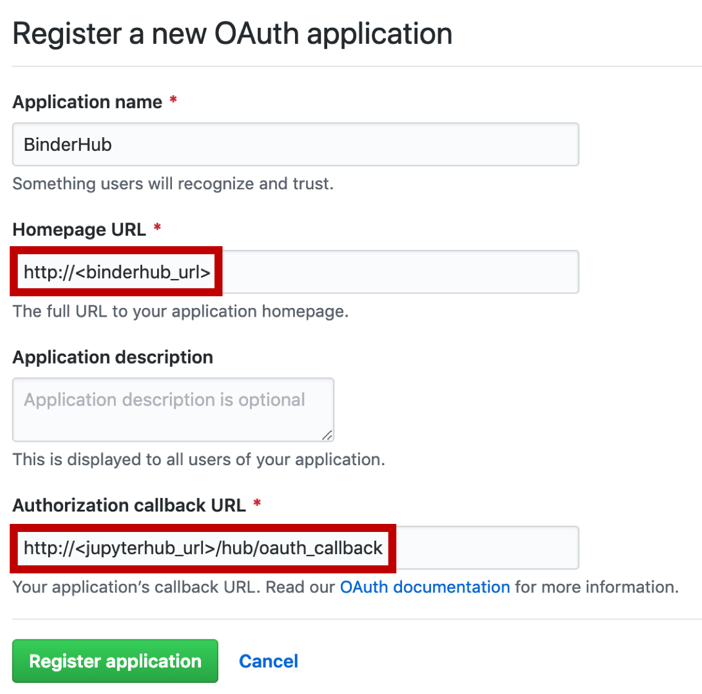

See the following docs:

- <https://binderhub.readthedocs.io/en/latest/authentication.html>
- <https://zero-to-jupyterhub.readthedocs.io/en/stable/authentication.html>

Table of Contents:

- [Enabling Authentication using JupyterHub as an OAuth provider](#enabling-authentication-using-jupyterhub-as-an-oauth-provider)
- [OAuth with GitHub](#oauth-with-github)

---

## Enabling Authentication using JupyterHub as an OAuth provider

#### Update `deploy/config.yaml` with the following configuration

```yaml
config:
  BinderHub:
    auth_enabled: true

jupyterhub:
  cull:
    # don't cull authenticated users
    users: False

  hub:
    services:
      binder:
        oauth_redirect_uri: "http://<binder-ip>/oauth_callback"
        oauth_client_id: "binder-oauth-client-test"
    extraConfig:
      hub_extra: |
        c.JupyterHub.redirect_to_server = False

      binder: |
        from kubespawner import KubeSpawner

        class BinderSpawner(KubeSpawner):
          def start(self):
              if 'image' in self.user_options:
                # binder service sets the image spec via user options
                self.image = self.user_options['image']
              return super().start()
        c.JupyterHub.spawner_class = BinderSpawner

  singleuser:
    # to make notebook servers aware of hub
    cmd: jupyterhub-singleuser

  auth: {}
```

This will set up the redirection to the JupyterHub for login and spin up user servers.

## OAuth with GitHub

#### Modify the `auth:` section of `deploy/config.yaml` to include the following

```yaml
auth:
  type: github
  github:

    callbackUrl: "http://<jupyter-ip>/hub/oauth_callback"
```

#### Modify `deploy/secret-template.yaml` with the following

```yaml
auth:
  github:
    clientId: "{github-client-id}"
    clientSecret: "{github-client-secret}"
```

Don't worry about `clientId` and `clientSecret` yet as we will generate these on GitHub.

#### Create an OAuth app on GitHub

Go to the `binderhub-test-org` organisation on `github.com`.
Under Settings -> Developer Settings -> OAuth Apps, click New OAuth App.
Fill in the form as per the image below and click Register Application:



This will create an OAuth app owned by `binderhub-test-org` that will allow anyone with a valid GitHub account to login to Hub23.

The `clientId` and `clientSecret` values will be generated.
Add these values to the key vault (see [`01-azure-keyvault.md`](01-azure-keyvault.md)) and create a `sed` command to populate `deploy/secret-template.yaml`.

#### Giving access to GitHub organisations

**_This section of the docs is a work in progress and needs improvement._**

Update `deploy/config.yaml` to include the following under `auth`:

```yaml
auth:
  type: github
  github:
    # ...
    orgWhitelist:
      - "binderhub-test-org"
  scopes:
    - "read:user"
```

The `read:user` scope will read a user's organisation/team memberships and look for `binderhub-test-org`.
If the membership is not found, they will be forbidden from accessing Hub23.
**This scope requires a user's membership of `binderhub-test-org` to be public.**
